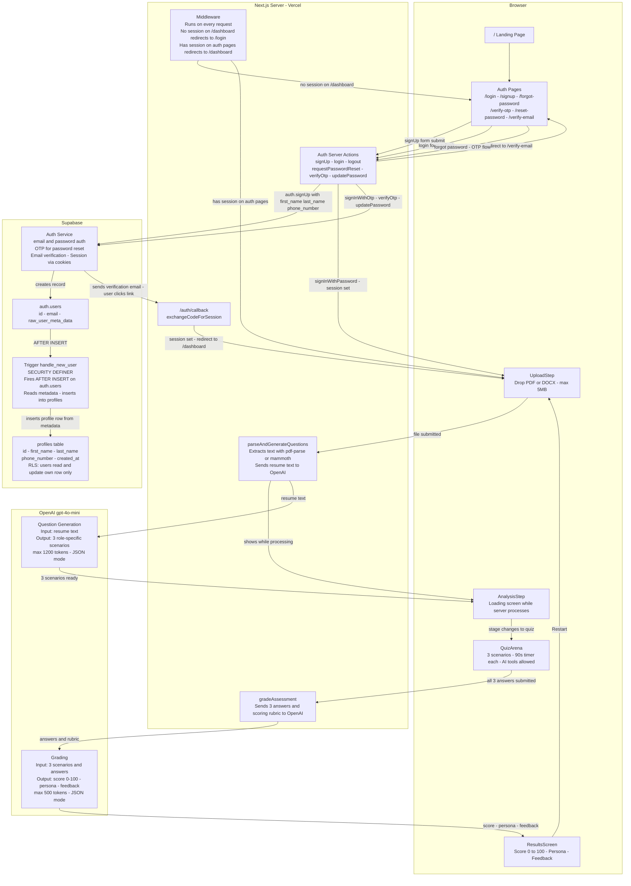

# AI Fluency Test

An AI-powered assessment that measures how well you use AI tools — not whether you have access to them.

---

## Architecture

> Assessment data (answers, questions, scores) is **never saved** to the database. Everything lives in React component state only.
