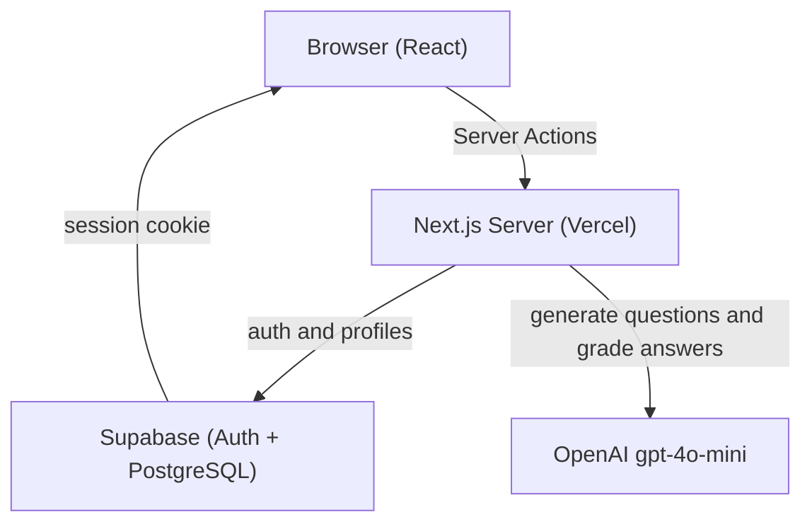
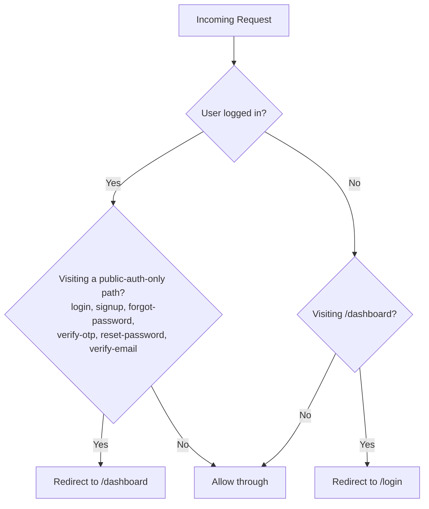
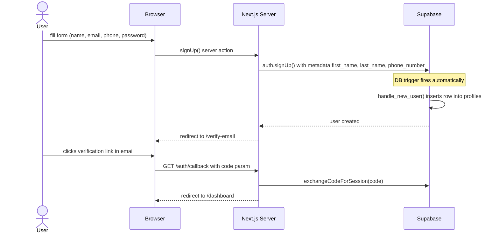
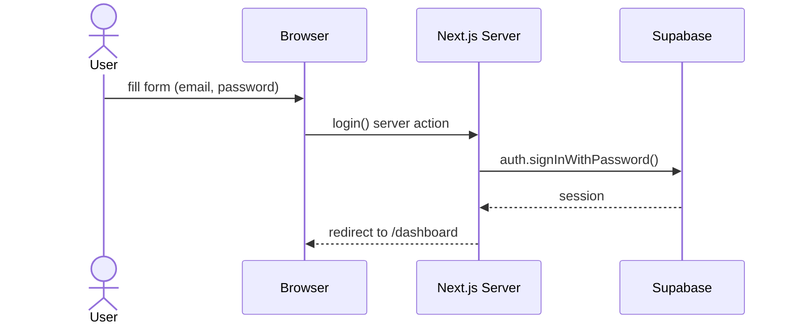
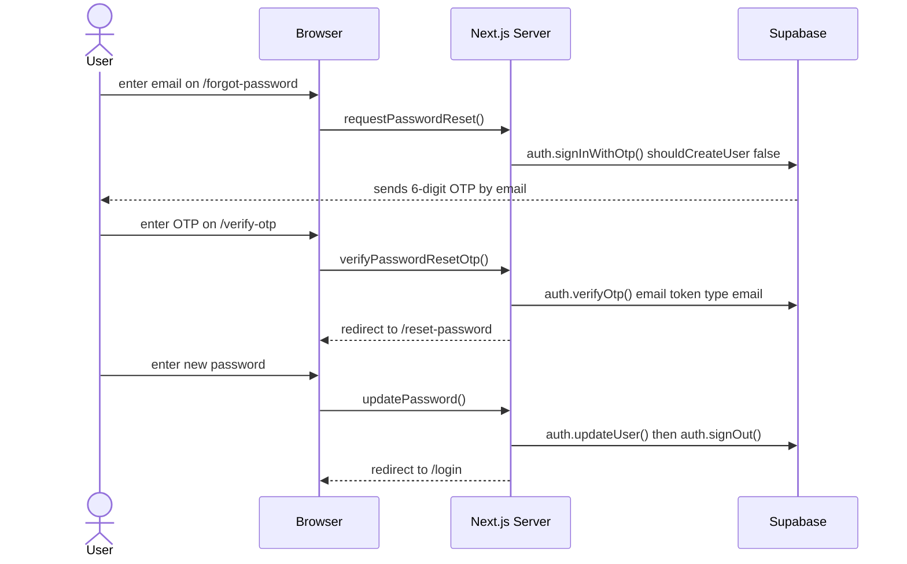
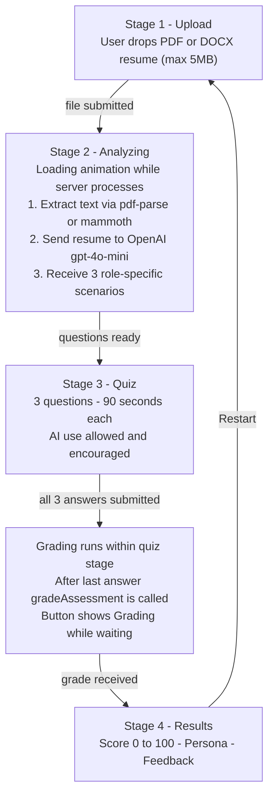
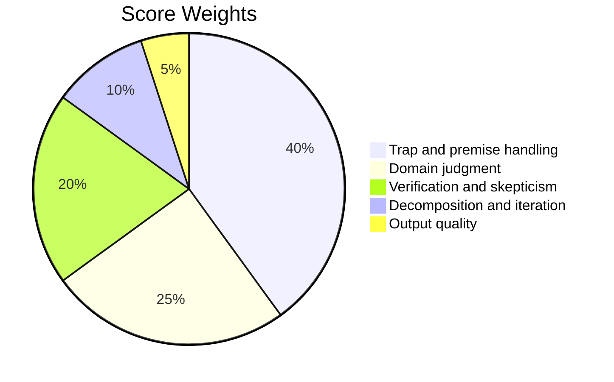
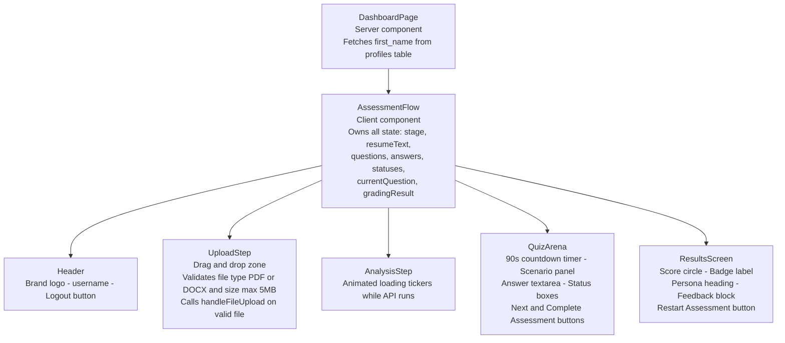
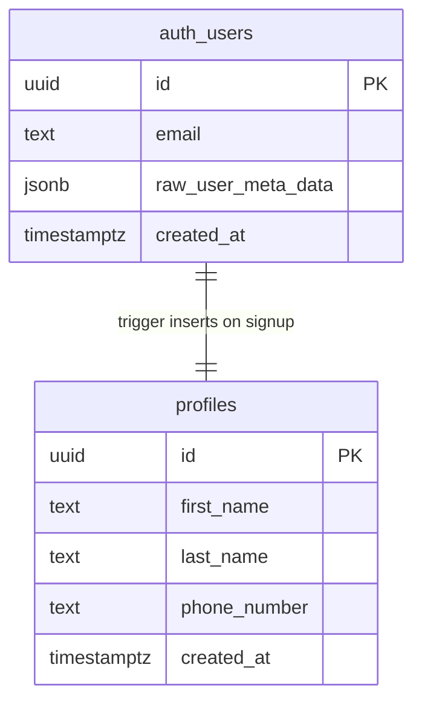
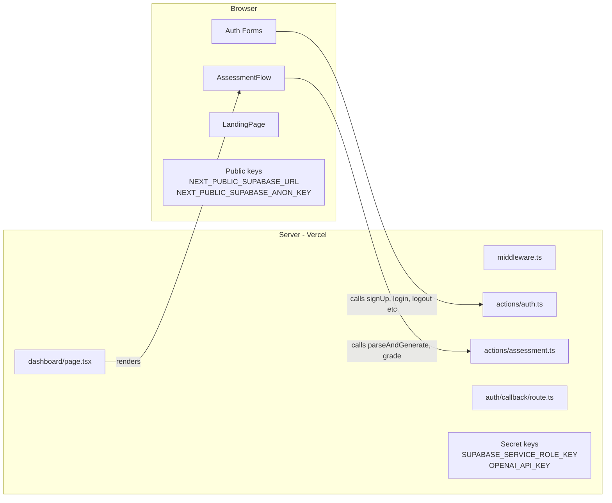

# AI Fluency Test

An AI-powered assessment that measures how well you use AI tools — not whether you have access to them.

---

## System Overview

---

## Pages and Routing

| Route | Access | Description |
|-------|--------|-------------|
| `/` | Public | Landing page |
| `/login` | Public | Sign in |
| `/signup` | Public | Create account |
| `/forgot-password` | Public | Request OTP |
| `/verify-otp` | Public | Enter OTP code |
| `/reset-password` | Public | Set new password |
| `/verify-email` | Public | Check your inbox (static) |
| `/auth/callback` | Public | Handles Supabase email redirect |
| `/dashboard` | **Protected** | Assessment app |

**Middleware logic — runs on every request:**

---

## Auth Flow

### Signup

### Login

### Password Reset

---

## Assessment Flow

### Grading Rubric

### Score Bands

| Score | Badge | Persona from OpenAI |
|-------|-------|----------------------|
| 70 – 100 | Strong Result (emerald) | Critical Operator |
| 40 – 69 | Room to Grow (amber) | AI-Augmented Professional |
| 0 – 39 | Needs Work (red) | Capable Paster or Passive Consumer |

> Assessment data (answers, questions, scores) is **never saved to the database**. Everything lives in React component state — refreshing the page resets the assessment.

---

## Component Tree

---

## Database

**RLS Policies on `profiles`:**
- `SELECT` — users can only read their own row
- `UPDATE` — users can only update their own row
- `INSERT` — users can only insert their own row (trigger handles this automatically)

---

## Server and Client Boundary

